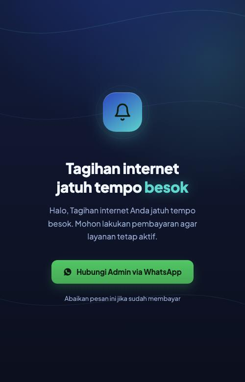
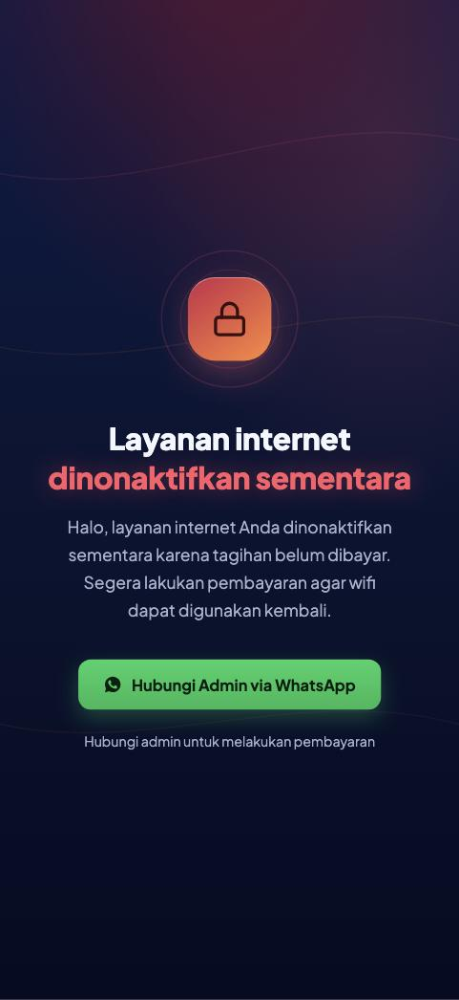

# 2 · Reminder Tagihan + Isolir — Hosting di MikroTik (Container)

Menampilkan **halaman pengingat tagihan otomatis** ke HP pelanggan (mirip splash
page wifi.id) saat **besok jatuh tempo (H-1)**, plus **halaman isolir** saat
pelanggan diblokir karena belum bayar.

Pada versi ini, halaman di-host **di dalam MikroTik sendiri** sebagai container —
**tanpa VPS, tanpa layanan luar**. Kalau lebih suka host di server terpisah, pakai
[folder 3 (VPS)](../3-reminder-tagihan-vps).

> ⚠️ Mengaktifkan container butuh **install paket + reboot** router. Di jaringan
> yang sedang dipakai pelanggan, lakukan saat **jam sepi (maintenance window)**.

### Beginilah tampilannya

<p>

&nbsp;&nbsp;

</p>

Lihat langsung: [reminder](https://faqihuddinhabibi.github.io/mikrotik-wisp-tools/)
· [isolir](https://faqihuddinhabibi.github.io/mikrotik-wisp-tools/isolir.html)

---

## Daftar isi
- [Apa yang Anda dapat](#apa-yang-anda-dapat)
- [Cara kerja (wajib paham)](#cara-kerja-wajib-paham)
- [Kelebihan & kekurangan versi container](#kelebihan--kekurangan-versi-container)
- [Yang perlu disiapkan](#yang-perlu-disiapkan)
- [Bagian A — Siapkan halaman sebagai container](#bagian-a--siapkan-halaman-sebagai-container)
- [Bagian B — Setup reminder di MikroTik](#bagian-b--setup-reminder-di-mikrotik)
- [Bagian C — Isi tanggal jatuh tempo](#bagian-c--isi-tanggal-jatuh-tempo)
- [Bagian D — Isolir (blokir + halaman)](#bagian-d--isolir-blokir--halaman)
- [Bagian E — Kecualikan pelanggan tertentu](#bagian-e--kecualikan-pelanggan-tertentu)
- [Tugas sehari-hari (contekan cepat)](#tugas-sehari-hari-contekan-cepat)
- [Batasan penting](#batasan-penting)
- [Kalau ada masalah](#kalau-ada-masalah)
- [Cara mencopot](#cara-mencopot)

---

## Apa yang Anda dapat

- **Reminder H-1 otomatis.** Sehari sebelum jatuh tempo, saat pelanggan
  menyambung wifi, HP-nya memunculkan popup halaman "tagihan jatuh tempo besok".
  Internet mereka **tetap menyala** (hanya diingatkan).
- **Isolir.** Untuk pelanggan telat, teknisi mengubah profilnya jadi profil isolir
  → internet **diblokir total** dan semua halaman diarahkan ke halaman isolir.
- **Pengecualian.** Pelanggan tertentu bisa dikecualikan agar tidak pernah melihat
  halaman reminder.

---

## Cara kerja (wajib paham)

```
Sehari sebelum jatuh tempo (H-1):
  scheduler (tiap 1 jam) baca "DUE:tanggal" dari comment tiap pelanggan
        │  kalau besok jatuh tempo & pelanggan online
        ▼
  IP pelanggan dimasukkan ke daftar "tagihan-reminder"
        │
        ▼
  MikroTik belokkan HTTP mereka → web-proxy → redirect ke halaman DI CONTAINER
        │
        ▼
  HP pelanggan memunculkan popup halaman reminder
```

**Kenapa popup muncul sendiri?** HP (Android/iOS) tiap menyambung wifi otomatis
menembak alamat cek-koneksi lewat **HTTP**. MikroTik menangkapnya → muncul
notifikasi "Sign in", persis wifi.id.

**Halaman ada di dalam MikroTik** (mis. IP `172.17.0.2`). Karena lokal, halaman
**selalu bisa dibuka** — bahkan saat pelanggan diisolir dan internet keluar diblok.

> Pelanggan memakai router sendiri (dial PPPoE)? **Tetap jalan** — semua trafik
> mereka lewat MikroTik.

---

## Kelebihan & kekurangan versi container

| Kelebihan | Kekurangan |
|-----------|------------|
| Tidak butuh VPS / internet — halaman lokal selalu tersedia | Perlu paket container + **reboot** (ada risiko di jam produksi) |
| IP halaman lokal, tidak pernah berubah | Memakai sedikit CPU/RAM/disk router |
| Berdiri sendiri (tidak bergantung pihak luar) | Update halaman = build & upload image ulang |

---

## Yang perlu disiapkan

- **MikroTik x86 / perangkat yang mendukung container**, RouterOS 7.x, ada disk/SSD.
- **Komputer dengan Docker** (untuk membangun image; bukan di router).
- Profil **isolir** + **pool IP terpisah** untuk isolir (kalau pakai fitur isolir).
  Cek dengan `/ip pool print`.
- Nomor **WhatsApp admin** untuk tombol di halaman.

---

## Bagian A — Siapkan halaman sebagai container

> **Penting soal "di mana dijalankan".** Ada **2 tempat kerja**:
> - 🖥️ **KOMPUTER** = laptop/PC Anda (Windows/Mac/Linux). Dipakai sekali untuk
>   membungkus halaman menjadi 1 file image.
> - 🪟 **WINBOX** = aplikasi untuk mengatur MikroTik. Sebagian besar lewat menu
>   (GUI); beberapa langkah perlu **New Terminal** (jendela ketik perintah di Winbox).
>
> Setiap langkah di bawah diberi label tempatnya. Ikuti berurutan, jangan dilompati.

---

### 🖥️ A1 — Ambil file halaman (DI KOMPUTER)

**Fungsi:** mengambil file proyek ini ke komputer supaya bisa diedit & dibungkus.

Ada 2 cara ambil file — pilih salah satu:

**Cara tanpa aplikasi tambahan (paling gampang):**
1. Buka https://github.com/faqihuddinhabibi/mikrotik-wisp-tools
2. Klik tombol hijau **Code → Download ZIP**.
3. Ekstrak ZIP-nya. Selesai — tidak perlu install `git`.

**Cara pakai git** (kalau nanti mau `git pull` untuk update):
1. Install git dulu — Windows: https://git-scm.com/download/win ·
   Mac: `brew install git` · Ubuntu: `sudo apt install git`.
2. Lalu:
   ```bash
   git clone https://github.com/faqihuddinhabibi/mikrotik-wisp-tools.git
   ```

---

### 🖥️ A2 — Ganti nomor WhatsApp di halaman (DI KOMPUTER)

**Fungsi:** supaya tombol di halaman menghubungi nomor admin Anda.

Buka 2 file ini pakai editor teks biasa (Notepad/TextEdit/VS Code):
- `docs/index.html`  → halaman reminder
- `docs/isolir.html` → halaman isolir

Cari tulisan `<!-- GANTI: nomor WA -->`, di bawahnya ganti `6281234567890`
dengan nomor admin (format `62...`, tanpa `+` dan tanpa `0` depan).

---

### 🖥️ A3 — Bungkus halaman jadi 1 file image (DI KOMPUTER)

**Fungsi:** MikroTik butuh halaman dalam bentuk "image" (1 file `.tar`). Langkah ini
membungkus nginx + halaman Anda menjadi file `reminder-web.tar`.

**Perlu Docker di komputer** (alat pembungkus). Install dulu:
Docker Desktop (Windows/Mac) https://www.docker.com/products/docker-desktop ·
Ubuntu: `sudo apt install docker.io`.

Lalu jalankan (dari dalam folder proyek):
- **Mac/Linux:**
  ```bash
  bash 2-reminder-tagihan-container/web/build-and-export.sh
  ```
- **Windows (PowerShell):**
  ```powershell
  docker build --platform linux/amd64 -f 2-reminder-tagihan-container/web/Dockerfile -t reminder-web:latest .
  docker save reminder-web:latest -o 2-reminder-tagihan-container/web/reminder-web.tar
  ```

Hasilnya: file **`reminder-web.tar`** di folder `2-reminder-tagihan-container/web/`.

> Tidak punya/tidak mau pasang Docker? Berarti versi container **bukan** untuk Anda —
> pakai [folder 3 (VPS, cukup nginx, tanpa Docker)](../../3-reminder-tagihan-vps).

---

### 🪟 A4 — Aktifkan fitur container di MikroTik (SEKALI SAJA, ADA REBOOT)

**Fungsi:** RouterOS defaultnya belum bisa menjalankan container; harus dinyalakan.
⚠️ Ada reboot — lakukan saat jam sepi.

1. **Install paket container:**
   - Di komputer, unduh `container-<versiRouterOS>.npk` **arsitektur x86** dari
     https://mikrotik.com/download (samakan versi dengan RouterOS Anda).
   - 🪟 Di Winbox, buka menu **Files**, lalu **drag-drop** file `.npk` itu ke situ.
   - 🪟 Menu **System → Reboot**. Setelah nyala, cek menu **System → Packages** →
     harus ada `container`.
2. **Nyalakan device-mode container** (langkah ini **harus lewat terminal**):
   - 🪟 Winbox → **New Terminal**, ketik:
     ```rsc
     /system/device-mode/update container=yes
     ```
   - RouterOS minta konfirmasi dengan **reboot** + (pada sebagian perangkat) tekan
     **tombol fisik** di router dalam beberapa detik. Ikuti tulisan di layar.
   - Cek (di New Terminal): `/system/device-mode/print` → baris `container: yes`.

---

### 🪟 A5 — Upload file image ke MikroTik (DI WINBOX)

**Fungsi:** memasukkan `reminder-web.tar` (hasil A3) ke router.

🪟 Winbox → menu **Files** → **drag-drop** file `reminder-web.tar` dari komputer
ke jendela Files.

---

### 🪟 A6 — Siapkan jaringan container (DI WINBOX)

**Fungsi:** membuat "jalur" jaringan kecil antara router (`172.17.0.1`) dan
container halaman (`172.17.0.2`).

Cara paling pasti: 🪟 Winbox → **New Terminal**, tempel 4 baris ini sekaligus:
```rsc
/interface/veth/add name=veth-web address=172.17.0.2/24 gateway=172.17.0.1
/interface/bridge/add name=br-docker
/ip/address/add address=172.17.0.1/24 interface=br-docker
/interface/bridge/port/add bridge=br-docker interface=veth-web
```
> Padanan GUI-nya (kalau mau lewat menu): **Interfaces → VETH** (buat `veth-web`),
> **Bridge** (buat `br-docker`), **IP → Addresses** (tambah `172.17.0.1/24` di
> `br-docker`), **Bridge → Ports** (masukkan `veth-web` ke `br-docker`). Tapi karena
> ada 4 langkah saling terkait, menempel 4 baris di atas lebih anti-salah.

---

### 🪟 A7 — Buat & jalankan container (DI WINBOX)

**Fungsi:** menjalankan halaman dari file image tadi.

1. 🪟 Winbox → **New Terminal**, cek nama disk:
   ```rsc
   /disk print
   ```
   Catat nama disk (mis. `disk1`). Ganti `disk1` di bawah kalau berbeda.
2. Tempel:
   ```rsc
   /container/config/set tmpdir=disk1/tmp
   /container/add file=reminder-web.tar interface=veth-web root-dir=disk1/web \
       logging=yes start-on-boot=yes
   /container/start [find]
   ```
   > Padanan GUI: menu **Container** → **Config** (isi `tmpdir`) → tombol **+**
   > (isi `file`, `interface`, `root-dir`) → pilih barisnya → **Start**.
3. Cek jalan:
   ```rsc
   /container/print
   ```
   Status harus `running`. Halaman kini ada di **http://172.17.0.2/** dan
   **http://172.17.0.2/isolir.html** (bisa dites dari PC yang sejaringan dengan router).

---

### 🖥️🪟 A8 — Update halaman nanti

Kalau mau ganti nomor WA / teks:
1. 🖥️ Edit `docs/*.html` di komputer → jalankan lagi langkah **A3** (build) →
   dapat `reminder-web.tar` baru.
2. 🪟 Upload tar baru ke **Files** (A5), lalu di **New Terminal**:
   ```rsc
   /container/stop [find]
   /container/remove [find]
   /container/add file=reminder-web.tar interface=veth-web root-dir=disk1/web start-on-boot=yes
   /container/start [find]
   ```

---

## Bagian B — Setup reminder di MikroTik

File [`mikrotik/setup-walled-garden.rsc`](mikrotik/setup-walled-garden.rsc) sudah
diset ke IP container `172.17.0.2`.

**Fungsi:** menyalakan web-proxy & aturan pengalihan HTTP untuk daftar
`tagihan-reminder`. Dijalankan **sekali**.

1. 🖥️ File script ada di komputer (folder `2-reminder-tagihan-container/mikrotik/`).
2. 🪟 Winbox → **Files** → drag-drop `setup-walled-garden.rsc` ke situ.
3. 🪟 Winbox → **New Terminal**, ketik:
   ```rsc
   /import file-name=setup-walled-garden.rsc
   ```

---

## Bagian C — Isi tanggal jatuh tempo

Sistem tahu jatuh tempo dari **comment** `/ppp secret`. Tambahkan `DUE:` diikuti
**tanggal** (pakai 1–28).

**Lewat Winbox (disarankan):**
1. **PPP → Secrets** → **double-click** pelanggan.
2. Isi kolom **Comment**, contoh: `Budi RT03 - 20Mbps | DUE:15` → **OK**.

Artinya jatuh tempo tanggal 15; reminder muncul tanggal 14 (H-1).

Atau via terminal (opsional):
```rsc
/ppp secret set [find name=budi] comment="Budi RT03 - 20Mbps | DUE:15"
```

### Pasang penjadwal (sekali)
**Fungsi:** menjalankan pengecekan tagihan otomatis tiap 1 jam.

1. 🪟 Winbox → **System → Scripts** → **Add (+)**. Isi **Name:** `billing-scheduler`,
   lalu tempel seluruh isi file
   [`mikrotik/billing-scheduler.rsc`](mikrotik/billing-scheduler.rsc) ke kolom
   **Source** → **OK**.
2. 🪟 Winbox → **New Terminal**, tempel:
   ```rsc
   /system scheduler
   add name=billing-scheduler interval=1h \
       on-event="/system script run billing-scheduler" \
       comment="Isi daftar reminder tagihan"
   ```
   > Padanan GUI: menu **System → Scheduler → Add (+)** (isi Name, Interval `01:00:00`,
   > On Event `/system script run billing-scheduler`).
3. Tes (🪟 New Terminal):
   ```rsc
   /system script run billing-scheduler
   /ip firewall address-list print where list="tagihan-reminder"
   ```

---

## Bagian D — Isolir (blokir + halaman)

### D1. Sesuaikan & jalankan setup
Buka [`mikrotik/setup-isolir.rsc`](mikrotik/setup-isolir.rsc), sesuaikan subnet
isolir:
```rsc
:local isolirNet "10.1.1.0/24"   ;# subnet pool isolir-mu; cek: /ip pool print
```
> **Cara tahu subnet isolir:** `/ip pool print` → lihat pool yang dipakai profil
> isolir. Range `10.1.1.2-10.1.1.254` → subnet `10.1.1.0/24`.

`redirectUrl` & `pageIp` sudah diset ke container `172.17.0.2`.

**Fungsi:** memblokir internet subnet isolir (kecuali DNS + halaman) & mengarahkan
semua HTTP-nya ke halaman isolir. Dijalankan **sekali**.

1. 🖥️ Edit `isolirNet` di file `mikrotik/setup-isolir.rsc` (di komputer).
2. 🪟 Winbox → **Files** → drag-drop `setup-isolir.rsc`.
3. 🪟 Winbox → **New Terminal**:
   ```rsc
   /import file-name=setup-isolir.rsc
   ```

### D2. Cara meng-isolir & mengaktifkan lagi (lewat Winbox — disarankan)

Pakai GUI supaya aman, tidak perlu ketik perintah.

**Meng-ISOLIR (pelanggan belum bayar):**
1. Winbox → menu **PPP** → tab **Secrets**.
2. **Double-click** nama pelanggan.
3. Di kolom **Profile**, pilih **profil isolir** (mis. `ISOLIR`) → klik **OK**.
4. Pindah ke tab **Active Connections**, klik pelanggan itu, tekan tombol **–**
   (remove) untuk memutus sesinya. Ia menyambung ulang otomatis dengan profil baru.

**Meng-AKTIFKAN lagi (sudah bayar):**
1. **PPP → Secrets** → double-click pelanggan.
2. Kolom **Profile** → pilih kembali profil paketnya (mis. `PAKET100`) → **OK**.
3. **PPP → Active Connections** → pilih pelanggan → tombol **–** (remove).

> Kenapa perlu remove di Active Connections? Supaya pelanggan langsung dapat IP
> sesuai profil baru. Kalau tidak, perubahan berlaku saat ia reconnect sendiri.

**Kapan halaman isolir muncul?** Terus-menerus **selama** profil pelanggan = isolir,
setiap kali menyambung wifi. Karena halaman ada di container lokal, **selalu bisa
dibuka** walau internet diblok.

---

## Bagian E — Kecualikan pelanggan tertentu

Agar pelanggan tertentu **tidak pernah** melihat halaman reminder, pilih salah satu:

**Cara A — tag `SKIP` di comment (lewat Winbox):**
**PPP → Secrets** → double-click pelanggan → tambahkan kata `SKIP` di kolom
**Comment** → **OK**. Contoh isi comment: `Kantor Desa - per 3 bln SKIP`.

**Cara B — daftar nama di `billing-scheduler.rsc`:**
```rsc
:local excludeNames ",kantor-desa,sekolah-01,puskesmas,"
```
(nama dipisah koma, **diapit koma** di awal & akhir).

---

## Tugas sehari-hari (contekan cepat)

| Mau… | Lakukan |
|------|---------|
| **Ganti tanggal tagihan** | PPP → Secrets → double-click → ubah angka setelah `DUE:` di Comment |
| **Isolir** pelanggan | PPP → Secrets → Profile = `ISOLIR`; lalu PPP → Active → remove sesinya |
| **Aktifkan lagi** | PPP → Secrets → Profile = paket semula; lalu PPP → Active → remove sesinya |
| **Kecualikan** dari reminder | PPP → Secrets → tambah `SKIP` di Comment (atau isi `excludeNames` di script) |
| **Ganti nomor WA / teks** | Edit `docs/*.html`, build & upload image ulang (A6) |

---

## Batasan penting

- **HTTPS tidak bisa dialihkan** (batasan semua captive portal). Popup muncul dari
  **cek-koneksi HTTP** otomatis HP saat menyambung wifi. Untuk kepastian ekstra,
  aktifkan notifikasi Telegram di `billing-scheduler.rsc`.
- **Font halaman saat isolir**: internet diblok, jadi font Google tidak termuat →
  halaman memakai font sistem (tetap rapi).

---

## Kalau ada masalah

| Gejala | Solusi |
|--------|--------|
| Container tidak `running` | Cek `/container/print`, `/log print`. Pastikan device-mode container `yes` & paket container terpasang. |
| Halaman tak kebuka dari HP | Cek `http://172.17.0.2/` dari router/PC di jaringan. Pastikan veth+bridge benar. |
| Reminder tak muncul | Cek daftar `tagihan-reminder`, web-proxy nyala, scheduler jalan. |
| Semua orang ke-redirect | NAT `wg-reminder-redirect` harus `src-address-list=tagihan-reminder`. |
| Halaman isolir tak kebuka | Pastikan `172.17.0.2` ada di `ALLOW-ISOLIR`. |

---

## Cara mencopot
```rsc
# reminder
/system scheduler remove [find name=billing-scheduler]
/system script remove [find name=billing-scheduler]
/ip firewall nat remove [find comment~"^wg-"]
/ip proxy access remove [find comment~"^wg-"]
/ip firewall address-list remove [find list="tagihan-reminder"]

# isolir
/ip firewall nat remove [find comment~"^iso-"]
/ip firewall filter remove [find comment~"^iso-"]
/ip proxy access remove [find comment~"^iso-"]
/ip firewall address-list remove [find list="ALLOW-ISOLIR"]

/ip proxy set enabled=no

# container (kalau mau dihapus total)
/container/stop [find]
/container/remove [find]
/interface/bridge/port/remove [find interface=veth-web]
/interface/veth/remove [find name=veth-web]
/interface/bridge/remove [find name=br-docker]
```
