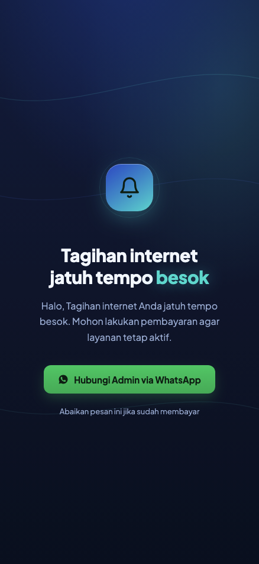
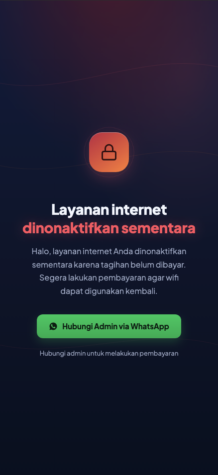

# mikrotik-wisp-tools

Kumpulan alat praktis untuk **WISP / RT-RW Net berbasis PPPoE** di MikroTik —
**tanpa aplikasi billing berbayar, tanpa langganan, dikontrol dari Winbox**.

Alat yang saling melengkapi:

1. **Notif profil berubah** — pesan Telegram saat profil pelanggan diubah
   (mis. diisolir/diaktifkan). *(Alat 1)*
2. **Reminder tagihan otomatis** — halaman pengingat muncul di HP pelanggan sehari
   sebelum jatuh tempo (mirip splash page wifi.id), **+ isolir** (blokir + halaman
   "silakan bayar"). *(Alat 2 atau 3, tergantung tempat hosting)*
3. **Notif connect/disconnect** — pesan Telegram real-time saat pelanggan
   terhubung/terputus. *(Alat 4)*

Berjalan di **RouterOS 7.x** (diuji di perangkat x86). Cocok untuk jaringan kecil
yang ingin otomatisasi sederhana tanpa server mahal.

---

## Tampilan halaman

<p>

&nbsp;&nbsp;

</p>

**Lihat langsung (demo):**
- Reminder H-1 → https://faqihuddinhabibi.github.io/mikrotik-wisp-tools/
- Isolir → https://faqihuddinhabibi.github.io/mikrotik-wisp-tools/isolir.html

> Nomor WhatsApp & teks bisa Anda ganti sendiri (lihat README tiap folder).

---

## Isi repo

```
mikrotik-wisp-tools/
├── docs/                          Halaman web (reminder & isolir) — file statis
│   ├── index.html                 Halaman "jatuh tempo besok" (H-1)
│   └── isolir.html                Halaman "layanan dinonaktifkan"
│
├── 1-notif-profil-pppoe/          ALAT 1 — notif Telegram saat profil berubah
│   ├── README.md                  (panduan lengkap langkah demi langkah)
│   └── pppoe-profile-watch.rsc
│
├── 2-reminder-tagihan-container/  ALAT 2 & 3 — reminder + isolir, halaman di CONTAINER MikroTik
│   ├── README.md
│   ├── mikrotik/                  script RouterOS (walled-garden, scheduler, isolir)
│   └── web/                       Dockerfile + skrip build image container
│
├── 3-reminder-tagihan-vps/        ALAT 2 & 3 — reminder + isolir, halaman di VPS
│   ├── README.md                  (setup nginx ada di README, tanpa Docker)
│   └── mikrotik/                  script RouterOS
│
├── 4-notif-koneksi-pppoe/         ALAT 4 — notif Telegram connect/disconnect
│   ├── README.md
│   ├── ppp-on-up.rsc              (script kolom "On Up")
│   └── ppp-on-down.rsc            (script kolom "On Down")
│
├── LICENSE
└── README.md
```

> **Reminder & isolir ada dua versi** (folder 2 & 3) — bedanya cuma **di mana
> halaman web di-host**. Pilih salah satu. Isi fitur MikroTik-nya sama.

---

## Pilih cara hosting halaman

Halaman reminder/isolir hanya file statis. Ada 3 cara menaruhnya; MikroTik tinggal
mengarahkan ke URL/IP-nya.

| Cara | Folder | Cocok kalau… | Catatan |
|------|--------|--------------|---------|
| **VPS (nginx)** | [`3-reminder-tagihan-vps`](3-reminder-tagihan-vps) | Punya server dengan IP tetap | Paling seimbang & **paling ringan**: nginx + 1 folder, update `git pull` (tanpa Docker) |
| **Container di MikroTik** | [`2-reminder-tagihan-container`](2-reminder-tagihan-container) | Tak mau server/internet luar | Halaman lokal selalu tersedia; **butuh Docker/OCI + paket container + reboot** |
| **GitHub Pages** | `docs/` | Sekadar coba cepat / gratis | Nol maintenance; IP bisa berubah → whitelist isolir rawan basi |

**Untuk fitur isolir** (yang perlu meng-whitelist alamat halaman), **VPS** atau
**container** lebih andal karena alamatnya tetap.

---

## Mulai dari mana?

1. Pasang **[Alat 1](1-notif-profil-pppoe)** dulu — paling mudah, hasilnya langsung
   kelihatan di Telegram.
2. Pilih **Alat 2 (container)** atau **Alat 3 (VPS)** untuk reminder + isolir, lalu
   ikuti README di folder tersebut dari atas sampai bawah.

Semua panduan ditulis langkah demi langkah untuk pemula.

---

## Konvensi comment `/ppp secret`

Data tagihan disimpan di **comment** tiap pelanggan (bebas formatnya, asal ada
token berikut):

| Token | Arti | Contoh comment |
|-------|------|----------------|
| `DUE:NN` | Tanggal jatuh tempo (pakai **1–28**) | `Budi RT03 - 20Mbps \| DUE:15` |
| `SKIP` | Jangan pernah tampilkan halaman reminder ke user ini | `Kantor Desa - per 3 bln SKIP` |

**Format yang disarankan** (mendukung semua alat sekaligus):
```
NAMA-DAERAH / nama pelanggan - DUE:NN
```
Contoh: `RT03 / Budi Santoso - DUE:15`
- Bagian **sebelum `/`** dipakai [Alat 4](4-notif-koneksi-pppoe) sebagai **Lokasi**.
- `DUE:NN` dipakai [Alat 2/3](2-reminder-tagihan-container) untuk reminder.
- Tambah `SKIP` kalau user tidak boleh kena halaman reminder.

- Reminder muncul **H-1** (sehari sebelum `DUE`).
- Script hanya **membaca** comment, tidak menimpanya.

---

## Batasan penting (baca sebelum pasang)

- **HTTPS tidak bisa dialihkan.** Situs `https://` tidak akan ke-redirect saat
  dibuka langsung — ini batasan **semua** captive portal (termasuk wifi.id). Yang
  memunculkan popup adalah **cek-koneksi HTTP** otomatis HP tiap menyambung wifi.
- Untuk kepastian ekstra, ada opsi notifikasi **Telegram** di script reminder.
- Pelanggan pakai router sendiri (dial PPPoE)? Tetap jalan — trafik lewat MikroTik.

---

## Lisensi

[MIT](LICENSE) — bebas dipakai, diubah, dan disebarkan. Semoga bermanfaat untuk
teman-teman WISP/RT-RW Net lain. Kontribusi & saran dipersilakan lewat Issues/PR.
